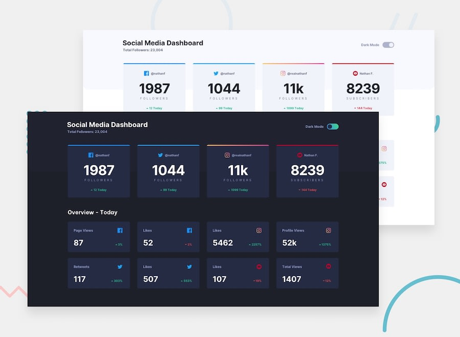

# Frontend Mentor - Social media dashboard with theme switcher

This is a solution to the [Social media dashboard with theme switcher](https://www.frontendmentor.io/challenges/social-media-dashboard-with-theme-switcher-6oY8ozp_H) challenge on Frontend Mentor.

## Table of contents

- [Overview](#overview)
  - [The challenge](#the-challenge)
  - [Screenshot](#screenshot)
  - [Links](#links)
- [My process](#my-process)
  - [Built with](#built-with)
- [Author](#author)

## Overview

### The challenge

Your users should be able to:

- View the optimal layout for the site depending on their device's screen size
- See hover states for all interactive elements on the page
- Toggle color theme to their preference

### Screenshot

### Links

- Solution URL: [Link](https://www.frontendmentor.io/solutions/social-media-dashboard-with-theme-switcher-A6emumxXl)
- Live Site URL: [Link](https://social-media-dashboard-with-theme-switcher.sz7kow.com/)

## My process

### Built with

- HTML
- JavaScript
- Sass

## Author
- Frontend Mentor - [@sz7kow](https://www.frontendmentor.io/profile/sz7kow)
